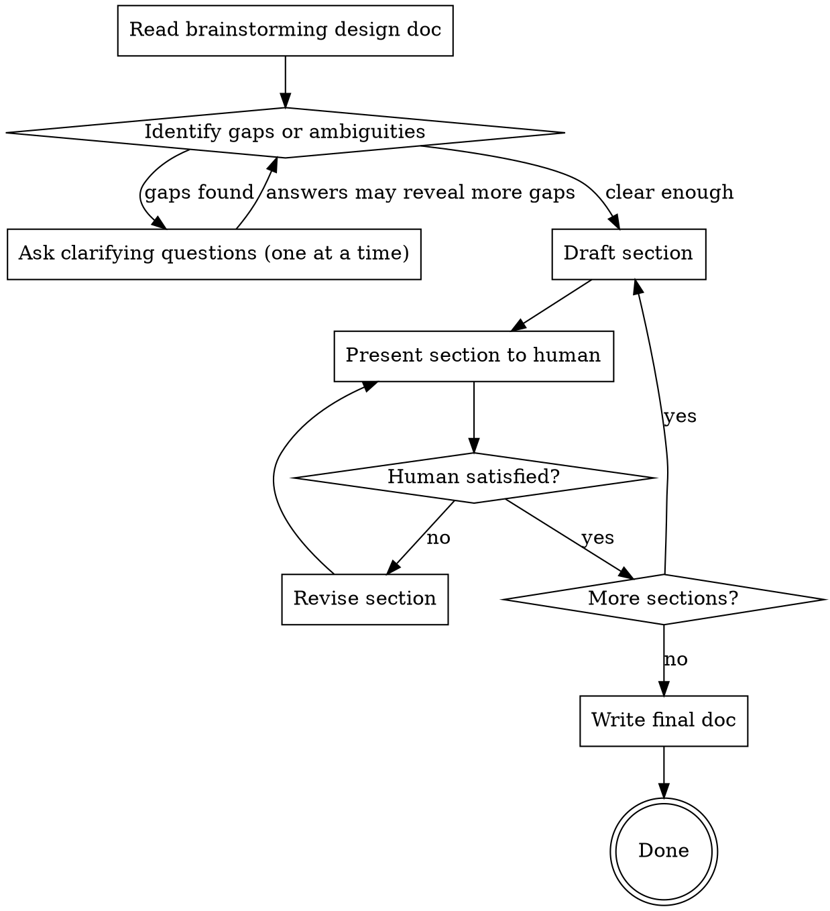

# Design Proposal

## Overview

Transform a brainstorming design doc into a concise, human-reviewable proposal document. The proposal describes the problem, solution, rationale, and user stories at a level that mixed audiences (engineers, product owners, designers) can evaluate and approve or request changes.

**Announce at start:** "I'm using the design-proposal skill to create a reviewable proposal from the design doc."

## The Process



### Step 1: Read and Assess the Design Doc

- Read the brainstorming design doc (typically `docs/plans/YYYY-MM-DD-<topic>-design.md`)
- Identify gaps, ambiguities, or assumptions that need clarification
- Consider: Is the problem clearly stated? Are user needs obvious? Is the rationale for the chosen approach explicit? Are trade-offs documented?

### Step 2: Ask Clarifying Questions

If anything is unclear or under-specified for a proposal audience:
- Ask questions **one at a time**, prefer multiple choice when possible
- Focus on intent, user impact, and rationale — not technical details
- Answers may warrant updating the original design doc — flag this to the human if so

**Formatting multiple choice questions:** Present options as a numbered list with a brief rationale for each. Bold the option labels so they're easy to scan. Example:

> **1. Bundle it in** — keeps the feature useful out of the box, avoids a follow-up project
>
> **2. Ship separately** — reduces scope and risk, but the feature is incomplete until the follow-up lands
>
> **3. Make it optional** — users who need it enable it, but adds configuration surface

### Step 3: Present Sections Incrementally

Draft and present each section one at a time. After each, ask if it looks right before moving on. The human may want revisions, reordering, or may realize the brainstorming doc itself needs changes.

**Formatting drafted sections:** Present each drafted section inside a markdown code block (` ```markdown `) so it stands out visually in the terminal. Do not use blockquotes — they render as dim text and are hard to read.

**Proposal sections in order:**

1. **Problem Statement** — What problem are we solving? Why does it matter? Who is affected? The Problem Statement describes only the problem and its impact. Do not include solution approaches, technical architecture, or how the system currently works internally. If you find yourself describing what will change, move that to Proposed Solution.

2. **User Stories** — Concrete scenarios from real user perspectives. Format: "As a [role], I want [goal] so that [benefit]." Up to 5 stories — use fewer for simpler problems. Only use roles that actually exist. Do not invent personas or scenarios to fill a template — if there are only two real user stories, write two. Never dress up implementation details as user stories.

3. **Proposed Solution** — What are we building and what does the work involve? This section should be **complete but not verbose** — cover every significant area of the system being changed, explain architectural decisions and why they matter, but never reference code-level details (variable names, struct fields, specific values). Describe the layers of work at a level where a non-implementer understands what's happening and why without needing to read the implementation plan. When the Proposed Solution covers multiple distinct areas, use `###` subsection headers with descriptive names — not bold sentence fragments. Each subsection should be self-contained enough that a reader can scan headers to understand the scope of work. After drafting, ask the human if anything important is missing — it's easy to gloss over areas that seem straightforward but matter to reviewers.

4. **Why This Approach** — What alternatives were considered? Why were they rejected? Why is this the best fit?

5. **Scope & Non-Goals** — What's in scope? What's explicitly out? Non-goals should be terse — just state what's out. If an out-of-scope item needs explanation (e.g., context about why it exists as separate work), that context belongs in an earlier section like Proposed Solution, not here.

6. **Risks & Open Questions** — What could go wrong? What's unresolved?

7. **Success Criteria** — How do we know this worked? State outcomes a user or operator would observe, not implementation details.

### Step 4: Write the Final Document

- Save to `docs/proposals/YYYY-MM-DD-<topic>-proposal.md`
- Commit to git
- Inform the human: "Proposal written to `docs/proposals/...`. It's ready for review."

## Length Constraints

**The proposal should not be longer than the project it describes.**

- **Most sections: max 200 words** unless the idea is genuinely complex enough to require more.
- **Proposed Solution is the exception** — completeness matters more than brevity here. Cover every significant area being changed, but don't be verbose about it. Say what needs to be said, no more.
- **User stories: up to 5.** Simple features may need only 1-2.
- **If a section feels padded, cut it.** Every sentence should earn its place.

## Output Format

```markdown
# [Feature/Project Name] — Design Proposal

**Date:** YYYY-MM-DD
**Status:** Draft | Under Review | Approved | Needs Changes
**Design Doc:** [path to brainstorming design doc]

---

## Problem Statement

[Why this matters, who is affected, what pain exists today]

## User Stories

- As a [role], I want [goal] so that [benefit].

## Proposed Solution

[What we're building, described accessibly]

## Why This Approach

[Alternatives considered, rationale for chosen approach]

## Scope & Non-Goals

**In scope:**
- ...

**Non-goals:**
- ...

## Risks & Open Questions

- ...

## Success Criteria

- ...
```

## Key Principles

- **Concise, not shallow** — Fight the urge to over-explain, but don't sacrifice completeness for brevity. Every significant area of work should be represented. If it can be said in one sentence, don't use three — but don't skip it entirely.
- **Right abstraction level** — Explain architectural decisions and why they matter. Never reference code-level details (variable names, struct fields, config values). The test: would a technical person outside the team understand why each decision was made?
- **Write for a mixed audience** — Engineers, product owners, and designers should all understand this without the technical design doc
- **One question at a time** — When clarifying, don't overwhelm
- **Flag upstream issues** — If questions reveal gaps in the brainstorming doc, tell the human so they can decide whether to update it
- **Incremental validation** — Present each section, get approval, then move on
- **No handoff** — This skill's job is done when the document is written. The human decides what happens next.
- **Honest about uncertainty** — If something is unclear even after questions, put it in Risks & Open Questions rather than papering over it
- **Never fabricate to fill a template** — If there are only two user stories, write two. If a section isn't needed, skip it. Padding with invented roles, scenarios, or filler is worse than a short document.
- **No unexplained references** — Never introduce a concept, system, or provider parenthetically without context. If something is mentioned, explain why it's relevant. If it's not worth explaining, it's not worth mentioning.
- **Propagate corrections** — When the human corrects a factual assumption (e.g., "there are no production clusters"), apply that correction across all remaining and future sections. Do not repeat an invalidated assumption elsewhere in the proposal.
